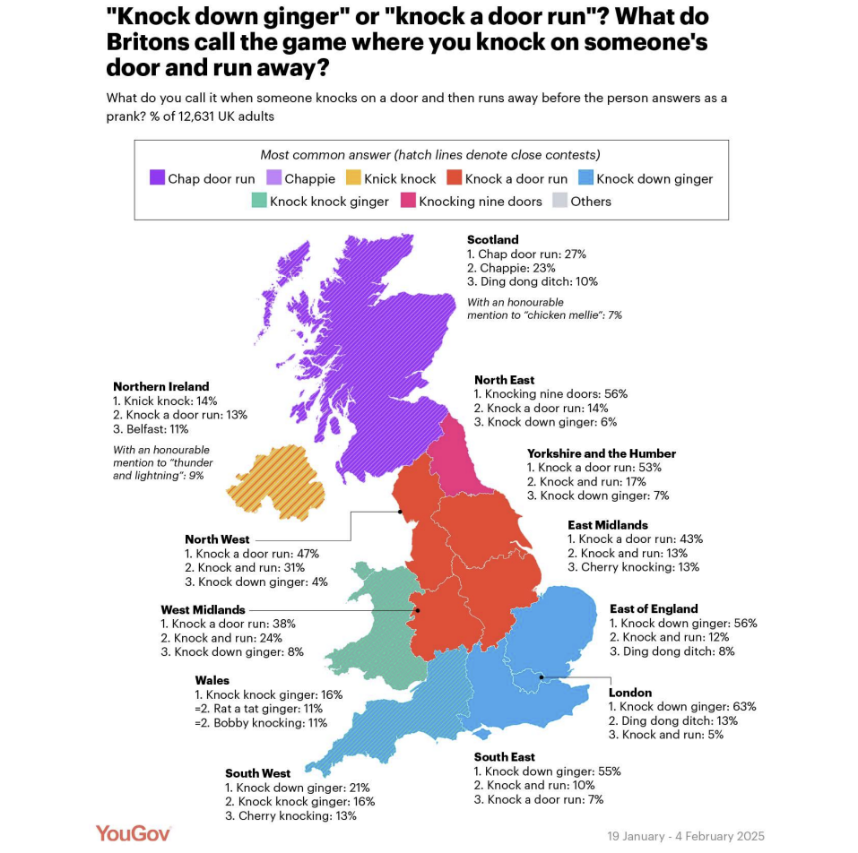
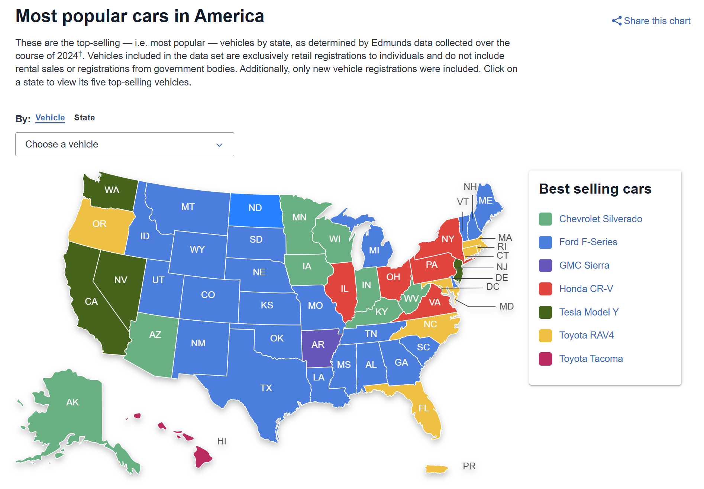
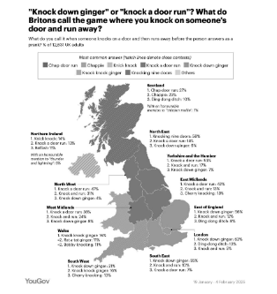
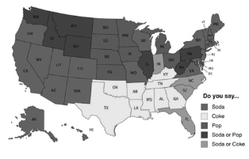

```{r setup, include=FALSE}
knitr::opts_chunk$set(echo = TRUE)
```

## Question 1

Across these 10 visualisation, three common errors can be identified. First, some visualisations are overcomplicated. This occurs when excessive density and details are to be effectively communicated on some data. Second, contextual elements like legends, labels, and titles in numerous visualisations lack clarity or are poorly chosen. This results in viewers being unable to comprehend the main points, thereby obstructing their understanding of the data. Finally, ineffective use of colours where some shades are overly similar for different categories, resulting in misinterpretations regarding the data being represented.

-----------------

## Question 2


Overcomplicated visualisations overwhelm viewers by presenting too much information. Arnheim (1947) argues that perceptual understanding relies on the presence of simple shapes. Across the five reports, several visualisations attempted to show large data sets using intricate diagrams with too many intersecting lines or dense annotations, resulting in difficulty for viewers to identify key patterns or compare values quickly. This complexity creates a problem for effective communication because viewers may find it frustrating to extract insights. This can result in a failure to connect with the content, thus the intended message becomes obscured, undermining the visualisation’s ability to inform or persuade. Therefore, complex visuals hinder comprehension rather than support it. A clean layout to present data in visualisations creates an aura of clarity and simplicity, thus it does not overwhelm the viewer and has persuasive effects (Kennedy et al., 2016). This means a clear layout has a more trustworthy effect on viewers who see them. Therefore, simplifying visual presentation is not only a design preference but also a critical factor in effective communication.

Unclear and poorly chosen labels can significantly reduce the impact of a visualisation. When labels fail to convey precise meaning, are absent, or are positioned far from the data, viewers could struggle to interpret the information the creator wanted to share. According to Vandemeulebroecke et al. (2019), every plot stands on its own; therefore, informative labels and captions should be used so that readers are not required to search through text to understand. This further emphasises the idea that clarity in labelling allows viewers to focus on the data instead of trying to decipher unclear information. Furthermore, Vandemeulebroecke et al. (2019) assert that the importance of the message must be impossible to miss, as it extends beyond graphical elements and involves all aspects of communication. Ultimately, precise and well-chosen labels enhance both clarity and impact, ensuring the data speaks for itself and reducing viewers’ cognitive load in understanding.

Colour choice can make or break communication in a visualisation. Estrada and Davis (2015) argue that "colour is applied to draw attention, to label, to show relationship, or to indicate a visual scale of measurement". When colours in a visualisation are too similar, it becomes difficult for viewers to distinguish between categories, therefore reducing the impact of the visualisations. "Differentiating shades of light blue is harder than differentiating, for instance, blue and yellow" (Gsellmann et al., 2023). This means that it is better if the colours are clearly distinct, especially when they are placed close to each other. If this issue persists, it can lead to misinterpretation or confusion. It can be worse for people with visual impairments such as colour-blindness, or as noted by Sorensen (2023), contrast vision deteriorates as people get older. Therefore, it is important that the colours chosen are not only aesthetically pleasing but also accessible to a wide range of viewers.

------------------

## Question 3

### Visualisation Chosen to Improve (1-1, visualisation 1)
{width=60%}  
mattsmithetc (2025). [OC] Mapped - what do Britons call the game where you knock on someone's door and
run away?. Reddit.
https://www.reddit.com/r/dataisbeautiful/comments/1insm19/oc_mapped_what_do_britons_call_the_game_whe
re_you/ 


### Improvements
1. Display Only the Most Popular Term  
The first improvement can be made by displaying only the most popular term in each region. Currently, each region is mainly coloured with the most used term, and the hatch lines indicate close results. However, this creates visual clutter because of the density of the information, which does not significantly change the message. Simplifying the data to “the most used” will reduce the cognitive load for viewers to comprehend the meaning. A useful comparison is from Reddit r/coolguides shared by user r/shantelley with the visualisation called “Coke, Pop, or Soda? Popular Names by State.” This shows that the data used is based only on the highest percentage reported, making it both clean and easy to read.  
{width=60%}  
[URL](https://preview.redd.it/wxnxjy16o7e31.jpg?width=640&crop=smart&auto=webp&s=23099dc7618b5ad1b871886aa8f8d29c05f6a379)


2. Remove Unnecessary Additional Information and Move  Legend  
Another improvement is to remove unnecessary additional information and move the legend. The additional information displaying the percentages of the top three most common answers in each region can be removed, as it is already effectively communicated through colour coding. Eliminating redundancy will reduce clutter and enhance clarity. Furthermore, relocating the legend to the side of the map and arranging it in ascending order according to the colours will facilitate viewers’ more intuitive understanding of the data and improve the overall readability of the visualisation. A good example of these improvements is in Edmunds’ “Most Popular Cars by State” map, which shows no percentages, and the relocation can be done to the visualisation.    
{width=60%}  
[URL](https://www.edmunds.com/most-popular-cars/)

3. Add Lines As Pointers  
Another improvement would be to add lines pointing to each region. While the current visualisation includes text labels identifying the regions, some texts do not match up with the lines for the supposed regions. This issue makes it difficult for viewers who are unfamiliar with the UK map to label regions with the most popular name of the game. Rather than solving this issue with abbreviations, which are more commonly used in the US maps provided above where state codes are widely recognised, adding simple lines from the labels to the relevant parts of the map would be more effective for this UK-based map. This will provide a clearer visual link and reduce ambiguity for both viewers who are familiar and unfamiliar with the UK map. The visualisation below shows clear lines indicating the names of major cities in India, which is a good example of this improvement.  
{width=60%}    
[URL](https://www.reddit.com/r/dataisbeautiful/comments/191s4s0/oc_a_population_density_map_of_india/)

4. Make Colour More accessible  
Another improvement would be to enhance the colour choice for accessibility. Specifically, the chosen colours of pink-red and green-blue, when viewed through a colour vision simulator, are hard to differentiate. The colour choice in the visualisation could be improved to enhance accessibility. Currently, the combination of pink-red and green-blue being very close together can be challenging to differentiate when viewed through a colour vision simulator. To address this issue, it is advisable to use colourblind-friendly colour palettes. Varying shades is also crucial to be accessible for people with monochromatic vision. A great example to compare is in the visualisation below where it uses the major cities uses primary colours where the rest are very different in colour and the addition of different shades enhance accessibility for all viewers. 

{width=60%}  
[URL](https://www.reddit.com/r/MapPorn/comments/c8hxkr/does_your_state_say_soda_pop_coke_or_a_combination/)

COMPARISON:  
Blue-Blind (Tritanopia)  
.png)  

-improvement.png)  


Monochromacy  
  


[colour vision simulator]( https://pilestone.com/pages/color-blindness-simulator?srsltid=AfmBOoravN8zx55z5huF5Ir_21no5aCsjWHmbKowIKyok0Bk-GTufioh)


------------------------------

#### References  
Arnheim, R. (1947). *Art and Visual Perception: A Psychology of the Creative Eye*. University of California Press. https://archive.org/details/art-and-visual-perception-rudolf-arnheim/mode/1up

Estrada, F. C. R. & Davis, L. S. (2015). Improving Visual Communication of Science Through the Incorporation of Graphic Design Theories and Practices Into Science Communication. *Science Communication, 37(1), 140–148.*. DOI: 10.1177/1075547014562914

Gsellmann, I., Hebesberger, M., Lazarevic, D. (2023). *Colour in Data Visualisation*. Graz University of Technology. https://courses.isds.tugraz.at/ivis/surveys/ss2023/ivis-ss2023-g2-survey-colour-for-datavis.pdf

Kennedy, H., Hill, R. L., Allen, W., Kirk, A. (2016). Engaging with (big) data visualizations: Factoes that affect engagement and resulting new definitions of effectiveness. *First Monday, 21(11)*. http://dx.doi.org/10.5210/fm.v21i11.6389

Sorensen, T. (2023). *Contrast Sensitivity and Aging Vision*. Rebuild Your Vision. https://rebuildyourvision.com/blog/vision-conditions/presbyopia/contrast-sensitivity-and-aging-vision/

Vandemeulebroecke, M., Billie, M., Margolskee, A., Magnusson, B. (2019). Effective Visual Communication for the Quantitative Scientist. *CPT Pharmacometrics Syst. Pharmacol 8, 705–719*. DOI: 10.1002/psp4.12455.